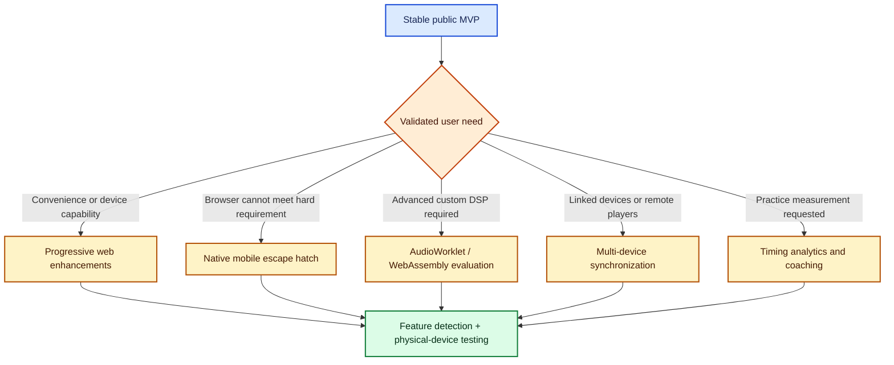

# Post-MVP roadmap and research

This file is the single source of truth for progressive enhancements and work outside the first public release. None of these items is an MVP dependency.

See [scope.md](scope.md) for the MVP contract and [vis_roadmap.md](vis_roadmap.md) for the launch path.

## Decision rule

Do not begin a future track because the supporting browser API or research paper exists. Begin only when:

1. The MVP is released and stable.
2. Real users demonstrate a need.
3. The desired outcome and supported platforms are explicit.
4. A measurable acceptance criterion is defined.
5. The added compatibility and maintenance cost is justified.

## Future work overview



## Progressive web enhancements

Each item is independently feature-detected and must disappear cleanly when unsupported.

### Screen wake lock

**Potential value:** Keep the display awake during long practice sessions.

**Required work:**

- Request the lock only while playback is active.
- Release it when playback stops.
- Detect automatic release when document visibility changes.
- Reacquire it only when permitted and appropriate.
- Test battery and interruption behavior on physical phones and tablets.

**Reference:** [Screen Wake Lock API](https://www.w3.org/TR/screen-wake-lock/)

### User-facing output-latency information

**Potential value:** Explain fixed speaker, wired, or Bluetooth delay and improve visual/audio alignment diagnostics.

**Required work:**

- Detect `baseLatency`, `outputLatency`, and timestamp support.
- Clearly distinguish estimated output latency from scheduler accuracy.
- Avoid presenting estimates as calibration-grade measurements.
- Recheck values after output-route changes.

**Reference:** [Synchronizing audio and video playback on the web](https://web.dev/articles/audio-output-latency)

### Haptic pulse

**Potential value:** Supplement audio with a tactile pulse or provide a simple non-auditory cue.

**Required work:**

- Treat vibration as optional and user-controlled.
- Restrict it initially to simple pulse patterns.
- Measure timing on actual device actuators; browser and hardware behavior varies.
- Preserve audio for complex subdivisions, grouping, and error correction.
- Evaluate accessibility with users rather than assuming equivalence to auditory cues.

**Research reference:** [Synchronizing to auditory and tactile metronomes](https://doi.org/10.3758/s13423-016-1067-9)

The study found that tactile synchronization can approach auditory performance for simple rhythms and sufficiently large-area stimulation. Auditory information retained an advantage for complex sequences, error correction, and higher-order grouping. Its role is to bound the haptic feature: tactile cues may supplement the metronome, but a phone vibration is not assumed to be a universal replacement for audio.

### Audio-output selection

**Potential value:** Let a user select a desired speaker or audio route where browser support permits it.

**Required work:**

- Detect device-enumeration and sink-selection support.
- Handle permissions, disappearing devices, and changed device identifiers.
- Fall back silently to the operating system's selected output.
- Test route changes during active playback.

### Shareable preset URLs

**Potential value:** Share BPM, meter, subdivision, accent, or practice configurations without accounts.

**Required work:**

- Define a versioned, compact URL schema.
- Validate and clamp all values loaded from a URL.
- Keep private local preferences out of shared URLs.
- Preserve backwards compatibility when preset fields evolve.

### Capability and standards watchlist

The [2021 Web Audio API Survey](https://www.w3.org/2011/audio/2021_Web_Audio_API_Survey.pdf) is community requirements evidence rather than a controlled timing experiment. Its 114 responses highlighted interest in areas such as audio-device selection and better AudioWorklet/WebAssembly integration; the results have informed W3C Audio Working Group priorities.

**Capacity and role:** Use it only as an ecosystem watchlist. It does not create product requirements. Recheck current standards and browser support before approving any capability.

## Advanced audio-engine track

The MVP uses scheduled built-in Web Audio nodes. Do not add this track unless profiling or audio tests prove that the standard graph cannot satisfy an approved requirement.

### AudioWorklet

[AudioWorklet: The Future of Web Audio - Hongchan Choi (PDF)](https://hoch.io/media/icmc-2018-choi-audioworklet.pdf)

**What the paper brings:** It explains why `ScriptProcessorNode` was unsuitable for dependable real-time processing and how `AudioWorklet` enables developer-authored sample-level processing in the audio rendering environment without sharing the UI thread.

**Capacity and role:** Advanced audio-engine reference. Use an `AudioWorkletProcessor` only if custom click generation, sample-level DSP, or audio-thread analysis cannot be implemented reliably with scheduled oscillator, buffer, gain, and automation nodes.

**Implementation reference:** [Using AudioWorklet - MDN](https://developer.mozilla.org/en-US/docs/Web/API/Web_Audio_API/Using_AudioWorklet)

### WebAssembly and Csound

[WebAssembly AudioWorklet Csound (PDF)](https://webaudioconf.github.io/papers/webassembly-audioworklet-csound.pdf)

**What the paper brings:** It demonstrates how a mature C/C++ synthesis engine can be compiled to WebAssembly and connected to AudioWorklet, including module loading, browser differences, and the interface between JavaScript, WebAssembly memory, and the audio renderer.

**Capacity and role:** Feasibility reference for importing an existing native DSP library or running demonstrably heavy processing. It is unnecessary for ordinary metronome clicks and does not justify a C/C++ or Csound toolchain by itself.

### JavaScript versus WebAssembly in AudioWorklet

[Comparing approaches for new AudioWorklets (2022, PDF)](https://zenodo.org/records/6767468/files/WAC_2022_paper_46.pdf)

**What the paper brings:** It compares native nodes, plain JavaScript AudioWorklets, and WebAssembly implementations written through C++ and AssemblyScript in Chrome and Firefox. The results and implementation discussion show that WebAssembly is not an automatic performance win; language boundaries, browser implementation, memory exchange, and development complexity all affect the outcome.

**Capacity and role:** Technology-selection counterweight. If a future custom DSP workload requires AudioWorklet, benchmark a clear JavaScript implementation before adding WebAssembly. This paper strengthens the current decision to use built-in `OscillatorNode`, `AudioBufferSourceNode`, `GainNode`, and parameter automation for the MVP.

## Native mobile escape hatch

Keep the public web app. Add a native branch only if testing proves that a firm product requirement cannot be met reliably in target browsers.

### Activation criteria

- Continuous metronome playback while the phone is locked.
- Predictable audio mixing or ducking with other applications.
- Native Bluetooth/audio-route selection and interruption handling.
- App-store discovery becomes a primary acquisition channel.
- Hardware MIDI or another platform integration exceeds reliable web support.

### Preferred approach

Package the existing web UI and shared metronome domain model with Capacitor for iOS and Android. Implement only the missing audio behavior in focused Swift and Kotlin plug-ins.

```text
shared UI and metronome domain model
              |
       +------+------+
       |             |
Web Audio engine   Native audio plug-in
public PWA         iOS/Android wrapper
```

**Reference:** [Capacitor documentation](https://capacitorjs.com/docs)

### Alternatives considered

| Approach | Appropriate capacity | Why it is not the default |
|---|---|---|
| Capacitor | Add native mobile capabilities to an existing web-first product | Requires app builds, store processes, and native plug-in maintenance |
| Tauri | Packaged desktop and mobile applications using web UI plus native code | Installation and platform tooling do not improve link-first ubiquity |
| React Native or Flutter | Native-first mobile products with substantial native UI requirements | Web becomes an additional target and the current web investment is less directly reusable |
| Separate native apps | Maximum platform control | Highest engineering, release, and maintenance cost |

## Multi-device synchronization track

[Synchronisation for Distributed Audio Rendering over Heterogeneous Devices, in HTML5 (PDF)](https://repository.gatech.edu/bitstreams/d5a4d069-fca4-4cd1-995b-b7271828f04a/download)

**What the paper brings:** It separates shared reference time, network jitter, audio-clock mapping, and fixed device output latency. The authors scheduled against a shared clock and reported individual playback accuracy of roughly 1-10 ms with a 5 ms standard deviation across the measured devices.

**Capacity and role:** Architecture reference for linked phones, synchronized rehearsal rooms, or remote ensemble features. It has no role in a single metronome running locally on one device.

**Required work:**

- Define the use case and an explicit synchronization tolerance.
- Establish a shared monotonic reference clock.
- Estimate network offset, delay, and jitter continuously.
- Map the shared clock to each device's local audio clock.
- Calibrate or estimate fixed output latency per device.
- Schedule locally ahead of time rather than triggering audio on message arrival.
- Handle devices joining, leaving, sleeping, or changing networks.

## Timing analytics and coaching track

Potential features include tap-accuracy scoring, practice trends, multiplayer rehearsal, and automatic latency calibration.

[Delayed feedback embedded in perception-action coordination cycles results in anticipation behavior](https://pmc.ncbi.nlm.nih.gov/articles/PMC6822724/) shows that early or late taps can reflect human prediction, tempo, expertise, feedback, and transmission delay rather than merely playback or input latency.

**Capacity and role:** Measurement-interpretation reference. It prevents future analytics from mislabeling all systematic tap offset as device error.

[REPP: A robust cross-platform solution for online sensorimotor synchronization experiments (2022)](https://doi.org/10.3758/s13428-021-01722-2) demonstrates a shared acoustic recording method that measures stimulus and tap onsets on one timeline. It is the preferred starting point if user-facing tap analysis is approved.

[A Maximum Length Sequence-Based Method for Robust Round-Trip Latency Estimation in Online Digital Audio Workstations (2025)](https://doi.org/10.5281/zenodo.17642262) uses browser playback, microphone capture, and cross-correlation to estimate device-dependent round-trip latency across browsers and operating systems.

**Capacity and role:** Future calibration method for recording, overdubbing, or tap-feedback features. Round-trip latency calibration does not improve the regularity of a playback-only metronome and is not an MVP dependency.

**Required work:**

- Separate systematic mean offset from tap-to-tap variability.
- Separate input latency, output latency, scheduler error, and human anticipation.
- Define whether the feature measures consistency, phase accuracy, tempo stability, or all three.
- Make calibration assumptions visible to the user.
- Validate scoring with musicians across skill levels and tempos.
- Avoid silently subtracting an assumed human or device offset.

## Future-track acceptance gates

| Track | Evidence required before implementation |
|---|---|
| Web capability | Current browser support matrix plus a user-visible benefit |
| Haptics | Physical-device timing tests and an accessibility use case |
| AudioWorklet | A measured limitation in the built-in Web Audio graph |
| WebAssembly | A measured workload or existing native library that justifies it |
| Native wrapper | A hard requirement that fails the target-browser test matrix |
| Multi-device sync | A validated use case and explicit millisecond tolerance |
| Timing analytics | A defined measurement model and user-tested interpretation |
