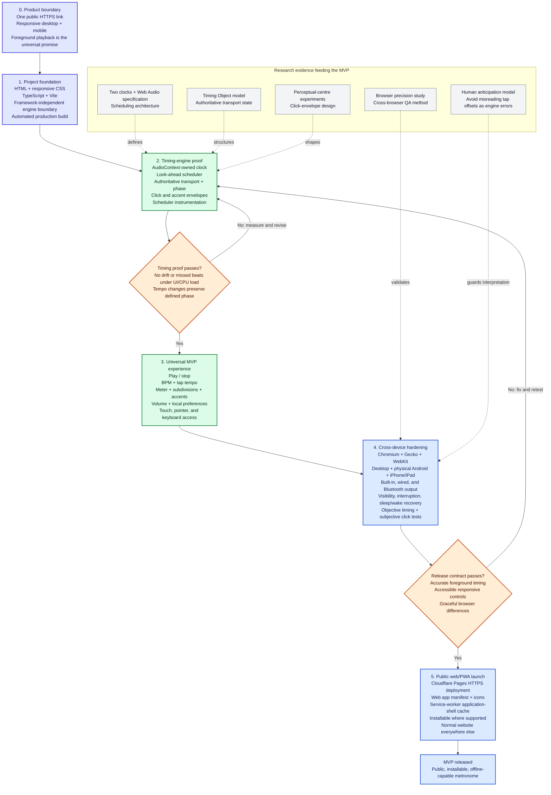

# Metronome MVP roadmap

This roadmap is sequence-based. Dates are intentionally omitted until delivery capacity and release targets are known. Post-MVP work is tracked in [future.md](future.md).

## Phase outcomes and exit criteria

| Phase | Outcome required before advancing |
|---|---|
| 0. Product boundary | Foreground web use and the installable/offline PWA are accepted as the MVP contract. |
| 1. Foundation | The production build succeeds and the audio engine has no dependency on the UI framework. |
| 2. Timing proof | The audio clock drives every beat; instrumentation shows stable intervals, no cumulative drift, and defined behavior during live tempo changes. |
| 3. Universal experience | A user can complete a normal practice session using touch, mouse, or keyboard on both narrow and wide layouts. |
| 4. Hardening | The compatibility matrix passes on physical Chromium, Gecko, and WebKit devices, including interruption and output-route scenarios. |
| 5. Launch | The HTTPS URL works normally, installation succeeds where supported, and the cached application shell launches without connectivity. |

## MVP release contents

- Accurate Web Audio look-ahead scheduling.
- Start/stop, BPM, tap tempo, meter, subdivisions, accents, and volume.
- Responsive and accessible desktop/mobile controls.
- Local preference storage.
- Cross-browser/device validation and interruption recovery.
- Cloudflare Pages deployment, PWA manifest, icons, and offline application-shell caching.
